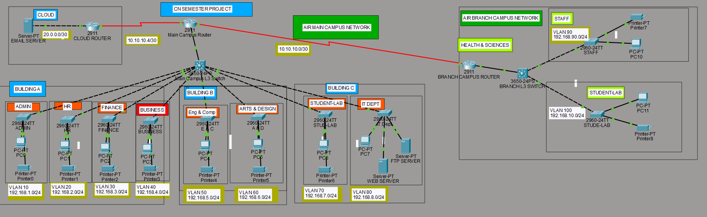

# 🌐 AIR University - Enterprise Network Simulation
> Computer Networks Semester Project | Cisco Packet Tracer


---

## 👥 Team Members
- **Hussnain Ahmad** 
- **Mahnoor Sohail**

---

## 📋 Project Overview
A fully functional enterprise network simulation for AIR University
built using Cisco Packet Tracer. The network consists of a 
Main Campus and a Branch Campus connected via WAN links, 
with complete departmental segmentation, security, and services.

---

## 🏛️ Network Architecture

### Main Campus (3 Buildings)
| Building | Departments |
|---|---|
| Building A | Admin, HR, Finance, Business |
| Building B | Eng & Comp, Arts & Design |
| Building C | Student Lab, IT Department |

### Branch Campus
| Department | VLAN |
|---|---|
| Staff | VLAN 90 - 192.168.90.0/24 |
| Student Lab | VLAN 100 - 192.168.10.0/24 |

---

## 🔧 VLAN Configuration

| VLAN | Department | Network |
|---|---|---|
| VLAN 10 | Admin | 192.168.1.0/24 |
| VLAN 20 | HR | 192.168.2.0/24 |
| VLAN 30 | Finance | 192.168.3.0/24 |
| VLAN 40 | Business | 192.168.4.0/24 |
| VLAN 50 | Eng & Comp | 192.168.5.0/24 |
| VLAN 60 | Arts & Design | 192.168.6.0/24 |
| VLAN 70 | Student Lab | 192.168.7.0/24 |
| VLAN 80 | IT Department | 192.168.8.0/24 |
| VLAN 90 | Staff (Branch) | 192.168.90.0/24 |
| VLAN 100 | Student Lab (Branch) | 192.168.10.0/24 |

---

## ✅ Features Implemented

- 🔀 **Multi-VLAN Architecture** — department-level network segmentation
- 🔁 **Inter-VLAN Routing** — via Cisco 3650-24PS L3 Switch
- 🌐 **Web Server** — AIR University Portal (www.airuniversity.edu)
- 📧 **Email Server** — internal university email communication
- 📁 **FTP Server** — file sharing for IT Department
- 🖨️ **Printer Access Control** — ACLs restrict each department to its own printer
- 🔄 **DHCP Server** — automatic IP assignment per VLAN
- 🔍 **DNS Server** — domain name resolution for university services
- 🌍 **Cloud Connectivity** — external email server via cloud router
- 🔐 **Network Security** — Extended ACLs for access control

---

## 🖥️ Devices Used

| Device | Model | Role |
|---|---|---|
| Main Campus Router | Cisco 2911 | Inter-campus routing |
| Branch Campus Router | Cisco 2911 | Branch routing |
| Cloud Router | Cisco 2911 | Cloud/internet gateway |
| Main L3 Switch | Cisco 3650-24PS | Inter-VLAN routing |
| Branch L3 Switch | Cisco 3650-24PS | Branch VLAN routing |
| Access Switches | Cisco 2960-24TT | Department access layer |
| Web Server | Server-PT | HTTP + DNS |
| FTP Server | Server-PT | FTP + DNS |
| Email Server | Server-PT | SMTP/POP3 |


---

## 🔐 Security Implementation

Extended ACLs applied to restrict printer access per department:
- Each department PC can **only** reach its own printer
- All other printer access is **blocked**
- Web, Email, and DNS services remain **accessible** to all VLANs


permit ip 192.168.x.0 0.0.0.255 host 192.168.x.3

deny   ip any host 192.168.x.3

permit ip any any

---

## 🌐 Services Configuration

| Service | Server | IP | Domain |
|---|---|---|---|
| HTTP/HTTPS | Web Server | 192.168.8.3 | www.airuniversity.edu |
| DNS | FTP Server | 192.168.8.4 | — |
| Email | Cloud Server | 20.0.0.2 | mail.airuni.edu |
| FTP | FTP Server | 192.168.8.4 | — |

---

## 📸 Network Topology


---

## 🚀 How to Open

1. Download and install **Cisco Packet Tracer**
2. Clone this repository:
```bash
git clone https://github.com/yourusername/air-university-network.git
```
3. Open the `.pkt` file in Cisco Packet Tracer
4. Explore the network topology and configurations

---

## 📚 Concepts Applied
- VLANs and Trunking (802.1Q)
- Inter-VLAN Routing (Layer 3 Switching)
- DHCP, DNS, HTTP, FTP, SMTP
- Extended Access Control Lists (ACLs)
- WAN connectivity
- Network Address Planning (subnetting)

---

## 📄 License
This project is for educational purposes only.

---

⭐ If you found this project helpful, please give it a star!
